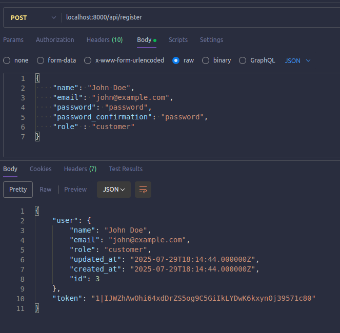
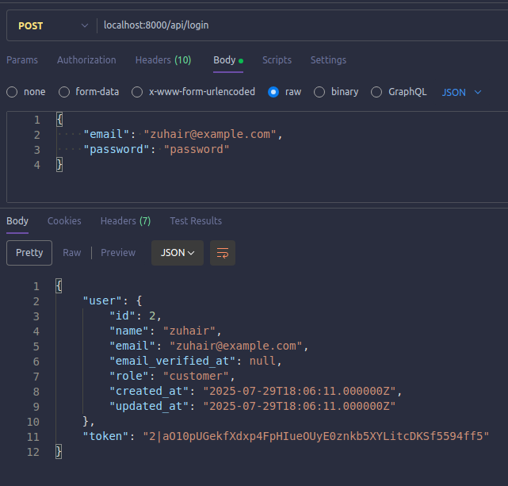
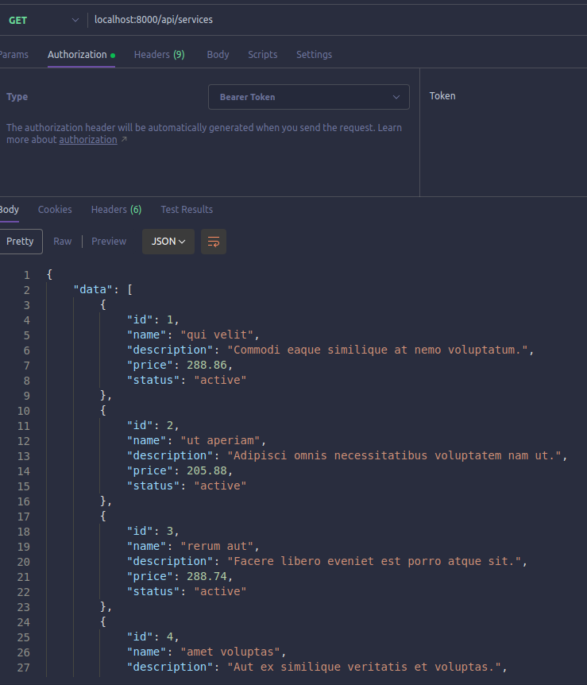
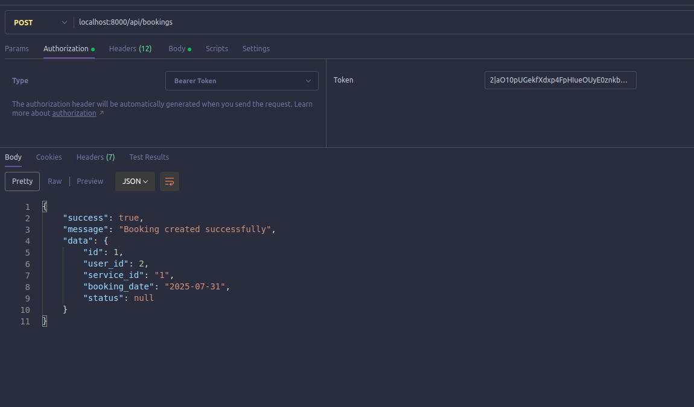

# Service Booking System (Laravel)

## Installation & Setup
1. git clone https://github.com/zuhair2025/service-booking-system.git
2. composer install

## Setup .env
DB_CONNECTION=sqlite 

## Run migrations
php artisan migrate

## Run Seeders
php artisan db::seed 

## Run the project
php artisan serve

# API Endpoints

## Register: /api/register

## Login: /api/login

        
## Get All Services: /api/services

## Add Booking: /api/bookings [method: POST]

